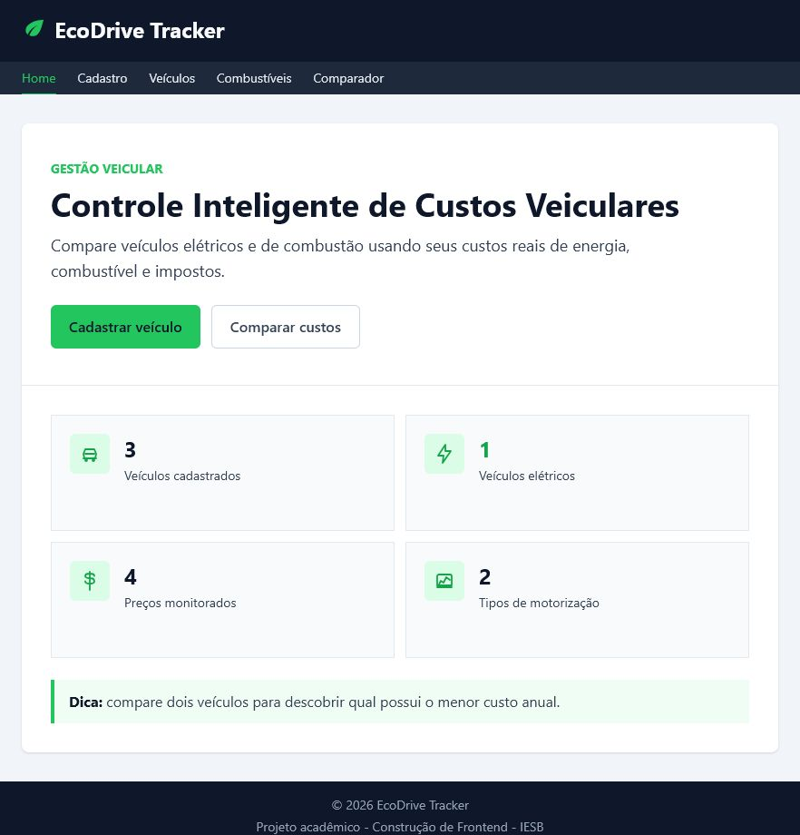
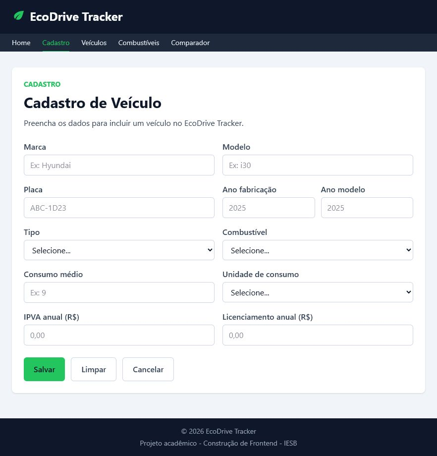
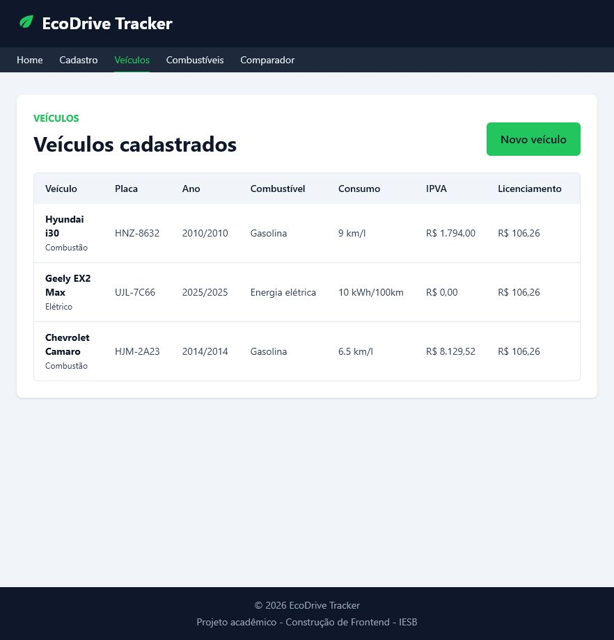
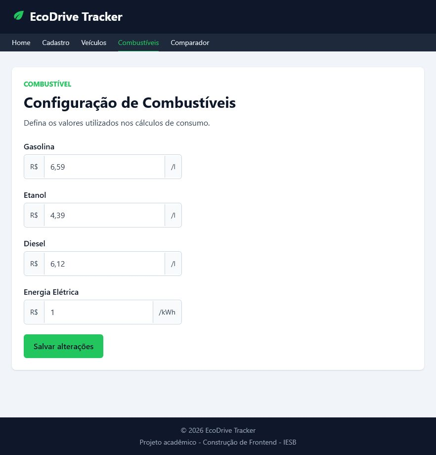
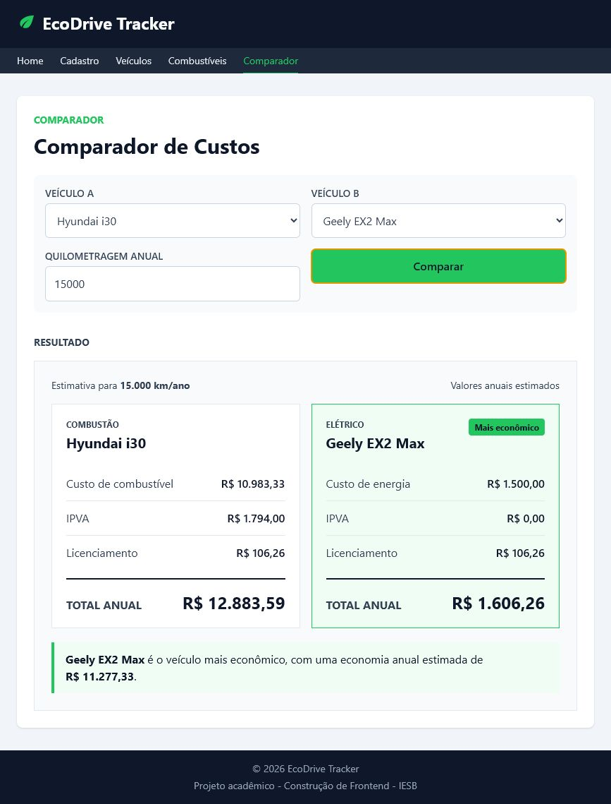

# EcoDrive Tracker

Aplicação web para cadastro de veículos, manutenção dos preços de combustíveis
e comparação do custo anual de uso entre dois automóveis.



## Sobre o projeto

O EcoDrive Tracker reúne dados de veículos a combustão e elétricos para ajudar
na análise de seus custos anuais. A aplicação permite administrar os veículos,
atualizar os preços usados nos cálculos e comparar dois modelos com base na
quilometragem anual informada.

O projeto foi desenvolvido como trabalho acadêmico da disciplina de Construção
de Frontend do IESB.

## Funcionalidades

- cadastro e edição de veículos;
- listagem e exclusão de veículos;
- configuração dos preços de gasolina, etanol, diesel e energia elétrica;
- comparação de dois veículos;
- cálculo do gasto anual com combustível ou energia;
- inclusão de IPVA e licenciamento no custo total;
- navegação responsiva com página de erro 404;
- persistência de dados por meio do JSON Server.

## Tecnologias

- [React 19](https://react.dev/)
- [Vite 8](https://vite.dev/)
- [React Router](https://reactrouter.com/)
- [React Hook Form](https://react-hook-form.com/)
- [Tailwind CSS 4](https://tailwindcss.com/)
- [JSON Server](https://github.com/typicode/json-server)
- [ESLint](https://eslint.org/)
- [Docker](https://www.docker.com/) e Docker Compose

## Pré-requisitos

Para a execução local:

- Node.js 22 ou superior;
- npm.

Para a execução em contêineres:

- Docker;
- Docker Compose.

## Instalação

Clone o repositório e instale as dependências:

```bash
git clone https://github.com/Gerebabh/ecodrive-tracker-react.git
cd ecodrive-tracker-react
npm install
```

## Execução local

Inicie o JSON Server em um terminal:

```bash
npm run test
```

Em outro terminal, inicie o frontend:

```bash
npm run dev
```

Acesse:

- frontend: [http://localhost:5173](http://localhost:5173);
- API: [http://localhost:3000](http://localhost:3000).

## Execução com Docker

Suba os serviços do frontend e do JSON Server:

```bash
docker compose up
```

Os serviços estarão disponíveis nas mesmas portas da execução local:

- frontend: [http://localhost:5173](http://localhost:5173);
- JSON Server: [http://localhost:3000](http://localhost:3000).

Para encerrar e remover os contêineres:

```bash
docker compose down
```

O `docker-compose.yml` utiliza volumes para compartilhar os arquivos do projeto
com os contêineres. Assim, as alterações locais são refletidas durante o
desenvolvimento.

## Execução em produção

A configuração de produção utiliza Nginx para servir o build do React e
encaminhar as requisições `/api` para o JSON Server em uma rede Docker
privada.

```bash
docker compose -f docker-compose.prod.yml up -d --build
```

O frontend fica disponível somente no host em
`http://127.0.0.1:8085`, permitindo sua publicação segura por meio de um
proxy reverso.

As instruções completas para DNS, Apache, HTTPS, atualização e backup estão no
[guia de deploy](docs/DEPLOYMENT.md).

## Scripts disponíveis

| Script | Descrição |
| --- | --- |
| `npm run dev` | Inicia o Vite em modo de desenvolvimento |
| `npm run test` | Inicia o JSON Server na porta 3000 |
| `npm run build` | Gera a versão de produção na pasta `dist` |
| `npm run preview` | Executa localmente a versão gerada pelo build |
| `npm run lint` | Analisa o código com o ESLint |

## Estrutura do projeto

```text
ecodrive-tracker-react/
├── components/          # Componentes reutilizáveis da interface
│   └── ui/              # Botões, cabeçalhos e mensagens genéricas
├── deploy/apache/       # VirtualHost usado na KVM
├── docs/screenshots/    # Capturas usadas nesta documentação
├── docker/              # Configuração do Nginx de produção
├── layouts/             # Estrutura visual compartilhada entre as páginas
├── pages/               # Páginas associadas às rotas
├── public/              # Arquivos públicos
├── src/
│   ├── assets/          # Imagens e recursos visuais
│   ├── contexts/        # Estados globais de veículos e combustíveis
│   ├── forms/           # Formulários da aplicação
│   ├── hooks/           # Hooks de acesso aos contextos
│   ├── services/        # API e regras de cálculo
│   ├── App.jsx          # Configuração das rotas
│   └── main.jsx         # Inicialização da aplicação
├── db.json              # Banco de dados do JSON Server
├── docker-compose.yml   # Serviços Docker de desenvolvimento
└── docker-compose.prod.yml # Serviços Docker de produção
```

## API e endpoints

A aplicação consome a API REST disponibilizada pelo JSON Server em
`http://localhost:3000`.

### Veículos

| Método | Endpoint | Operação |
| --- | --- | --- |
| `GET` | `/veiculos` | Lista os veículos |
| `GET` | `/veiculos/:id` | Consulta um veículo |
| `POST` | `/veiculos` | Cadastra um veículo |
| `PUT` | `/veiculos/:id` | Atualiza um veículo |
| `DELETE` | `/veiculos/:id` | Exclui um veículo |

### Combustíveis

| Método | Endpoint | Operação |
| --- | --- | --- |
| `GET` | `/combustiveis` | Lista os preços cadastrados |
| `GET` | `/combustiveis/:id` | Consulta um preço |
| `PUT` | `/combustiveis/:id` | Atualiza um preço |

## Fórmula do comparador

Para veículos com consumo em `km/l`:

```text
consumo anual = quilometragem anual / consumo médio
custo de combustível = consumo anual × preço por litro
```

Para veículos elétricos com consumo em `kWh/100km`:

```text
consumo anual = (quilometragem anual × consumo médio) / 100
custo de energia = consumo anual × preço do kWh
```

O custo anual total é calculado da seguinte forma:

```text
custo total = custo de combustível ou energia + IPVA + licenciamento
```

O veículo com o menor custo total é apresentado como o mais econômico. A
diferença exibida corresponde à subtração entre os totais dos dois veículos.

## Capturas de tela

### Cadastro



### Veículos



### Combustíveis



### Comparador



## Planejamento

As issues, milestones e etapas de desenvolvimento estão organizadas no
[Kanban do EcoDrive Tracker](https://github.com/users/Gerebabh/projects/8).

## Autoria

Desenvolvido por [Geraldo Santos](https://github.com/Gerebabh).

- Instituição: IESB
- Disciplina: Construção de Frontend
- Professor: Jose Reginaldo de Sousa Mendes Junior
- Projeto acadêmico: EcoDrive Tracker
